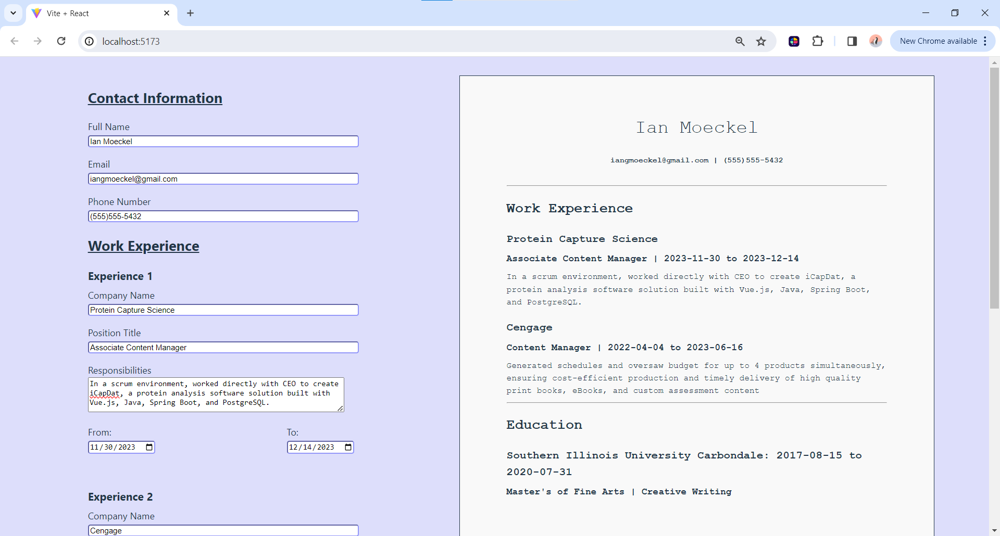
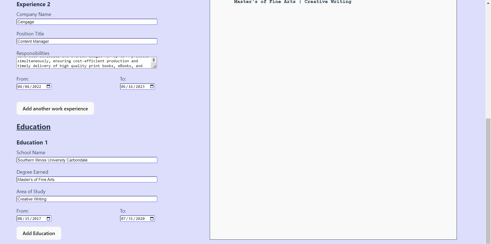

# React CV 
Odin Project exercise. Live web application that allows users to complete fields for a CV, and fields will fill dynamically. Ability to add or remove work/education experience. The focus was to understand passing props, raising state, and data binding. Lord forgive the folder structure and CSS.

## View Deployed Site
https://ubiquitous-marshmallow-f4011c.netlify.app/

## Install Locally
1. Clone the repo with git clone [url]
2. cd into the project directory
3. Run npm install to install dependencies
4. Run npm run dev and open it in the browser.

## Technology Stack
* Frontend framework: React.js
* Build tool: Vite
* Host: Netlify

## Screenshots

---

